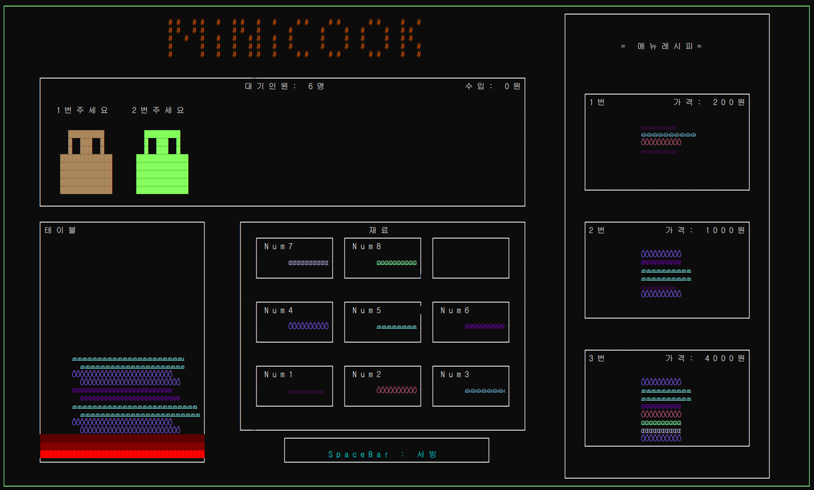
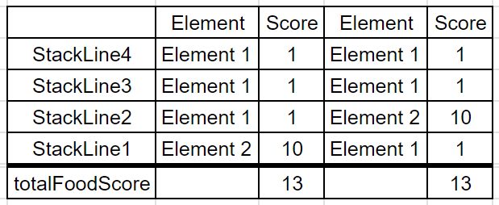
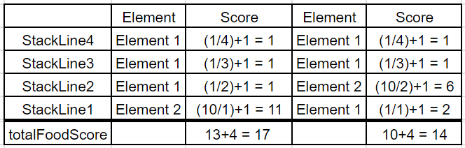

# MiniCook ConsoleProject
- ## Contents
    ### `프로젝트명 : MiniCook`
  
   - ####  이미지
  
   - 플레이영상
  

- ## Contents Description
  > ### 프로그램 
    - 고객이 요구하는 햄버거를 만들어 제공하는 게임입니다.   싱글플레이를 기반으로 손님이 원하는 주문을 받아  모든 음식을 만들어 제공하는것이 목표입니다 
  
  > ### 게임 진행방식 
    1. 숫자 키패드를 활용해 필요한 음식 재료를 쌓아 올립니다.
    2. 스페이스바, 엔터키를 입력해 현재까지 쌓아 올린 음식을 손님 측으로 제시합니다.
    3. 고객의 주문 중 일치한 주문이 있다면 골드를 획득합니다.
    4. 일치한 주문이 없다면 소지골드가 차감됩니다.
   > ### 구현 방법
    - 레이아웃시스템을 구상해 제작 간 편의성을 제공합니다.

    - 게임의 주요 핵심이 되는 매니저클래스는 싱글톤 디자인패턴으로 구현하였습니다.
    
    - 프로그램의 전반적인 흐름구조, 각 이벤트, 게임내 설정값들을 하나의 공간에서 관리합니다.

    > ### 구현 방법을 선정한 이유
    
    - 레이아웃 
      - 수동적으로 콘솔 커서의 위치를 조정해 UI를 구상하게 될경우 제작의 어려움과 가독성, 유지보수성이 크게 떨어집니다. 레이아웃시스템을 활용할 경우 각 영역의 용도와 출력되어야할 목록을 쉽게 관리할 수 있으며 사용자에게 각 공간의 명확한 공간을 인식시켜줄 수 있음과 동시에, 개발자에게 보다 빠른 개발속도, 유지보수비용, 가독성을 제공하기 위함입니다.
    
    - 싱글톤 디자인패턴
      - 프로그램내에 필요한 클래스가 하나의 객체만 필요한경우 두개 이상의 객체생성을 방지하여 단일성을 유지시킬 수 있습니다.  또한 여러곳에서 접근이 빈번할 경우 전역적인 특징을 활용해 간편한 접근이 가능합니다.
    
    - 핵심 데이터 · 로직의 집중화
      - 집중화를 통해 각 진행단계를 한눈에 쉽게 파악이 가능하며 프로그램의 핵심 멤버와 로직을 한 영역에 집중시켜 개발 유지보수성을 높였습니다.  이는 프로그램의 문제 발생시 쉬운 디버깅이 가능하여 개발비용 절감의 이점을 얻을 수 있습니다.
    
- ## 발생 이슈와 해결방법
    > ### Singleton, Static 클래스
     - 문제점
       - 단일성, 전역적인 접근이라는 공통점을 갖게 됨으로써 코드작성의 기준이 명확하지 않음
     - 해결방안
       - Static 클래스의 경우 프로그램 실행 시 해당 프로그램이 종료될 때 까지 메모리에 상주하게 된다.
          즉 적합한 용도로 구현하지 않게 될 경우 메모리낭비로 이어지게 됨을 의미하게 된다.
         싱글톤의 경우 단일객체 인스턴스를 null 로 전환하여 이와 같은 문제점을 방지할 수 있다.
          프로그램의 클래스 작성 시 프로그램이 동작하는 동안 항상 필요한경우 Static 클래스를 활용하고,
          반면 필요없는 상황에 언제든 메모리를 해제시켜 이점을 챙길 수 있다 라는 판단이 될 경우 Singleton 디자인패턴을 활용한다.
    > ### CustomerContainer 클래스 내부의 Customer 관리
    - 문제점
      - 대기중인 Customer 객체집합 내의 요소에 빠른 접근, 추가, 삭제에 필요한 자료구조 선정
    - 해결방안
      - Queue : 비적합
        - for, foreach 문을 통해 각 객체에 접근이 불가능하며, 접근이 필요할 시 각 요소를 전부 반환해야만 함
      - List : 적합
        - 각 요소의 접근해 필요한 데이터를 쉽게 확인이 가능하며 추가, 삭제시 큰 문제는 없다.
      - LinkedList : 적합
        - Next 메서드를 통해 모든요소에 쉽게 접근이 가능하여 순열리스트와 같은 효율성을 갖고 있다.
        - Customer Remove 메서드가 동작할 경우 각 노드의 주소값만 변경하므로 순열리스트의 Remove 메서드보다 효율성이 높다.
    > ### Burger 객체의 비교방식
    - 문제점
      - Burger 객체는 여러 FoodElement로 구성된다.
        만약 유저가 제작한 Burger객체의 FoodElement와 고객이 원하는 Burger의 FoodElement를 전부 비교하는 방식은 비효율적인 방식으로 판단
    - 해결방안
      - 모든 음식객체(FoodElement, Burger)는 각자 FoodScore라는 정수값을 갖게하여 각 숫자의 비교만으로 Burger객체가 동일한지 판단하는 방식을 채택
    > ### FoodScore 판정 문제점
    - 문제점
      - Burger를 구성하는 FoodElement는 각자 FoodScore를 갖고 있지만 이러한 값으로만 Burger객체 판정시  구성 및 순서가 다른 Burger 또한 같다 라는 판정이 나오게 된다.
      
        ### `ex)` Element1 Score = 1 , Element2 Score = 10
        

    - 해결방안
      - 해시값과 비슷한 방식을 채택 ( ∑ (FoodElement ÷ StackLine) + 1) + TotalStackCount 계산방식을 활용해 구성과 순서를 지키며 각 위의 문제점을 해결할 수 있다.
      
        
    > ### 각 클래스간의 결합도
    - 문제점
      - 프로그램의 목적상 입력처리 매니저의 경우 특정 키 입력시 프로그램에서 목적에 맞는 행위를 수행해야 한다.  입력처리 매니저의 경우 각 행위가 필요한 객체를 전부 참조하게 될 경우 클래스간 결합도가 크게 증가하게 된다. 
    - 해결방안
      - 각 입력키에 대한 이벤트를 정의하고 행위가 필요한 클래스의 객체가 개별적으로 각 이벤트에 자신을 등록하여  입력이 발생하는경우 상황에 맞는 행위를 발생시키도록 구현
    > ### 시간 기반의 기능구현
    - 문제점
      - CustomerContainer 의 클래스에서는 비어있는 자리에 대기중인 Customer를 배치시켜야한다.
       이때 while문으로 빈자리를 매번 체크하는 로직을 작성하게 되는경우 메인스레드의 성능저하를 유발할 수 있다.
    - 해결방안
      - CustomerContainer 전용 Thread를 별도로 생성하여 SettingManager 에 설정된
        빈자리 확인딜레이 값을 확인해 지정된 시간(Sec)단위로 빈자리가 발생되었는지 확인하는 로직을 구현

